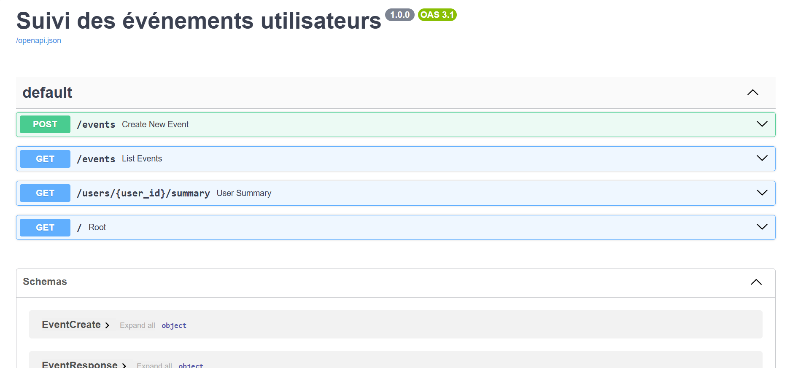
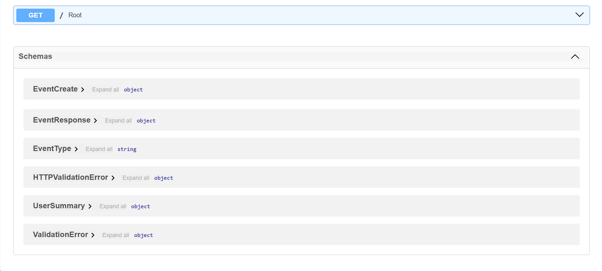
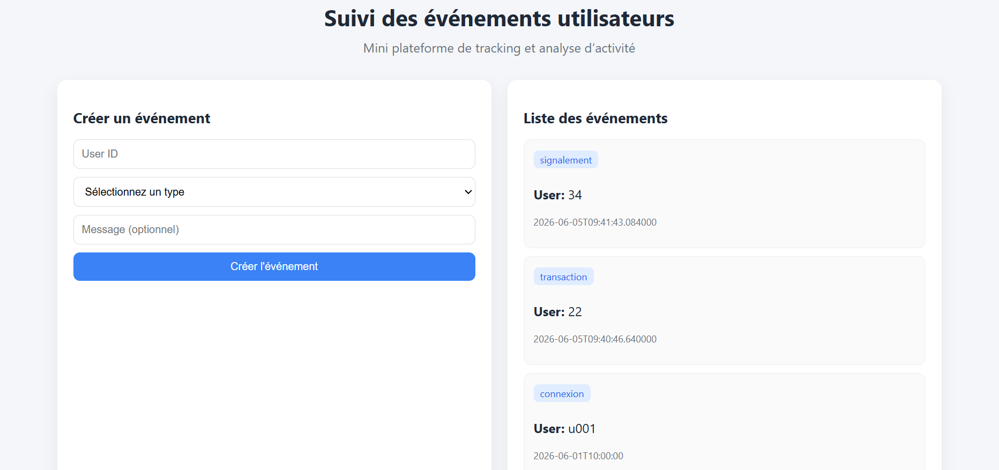
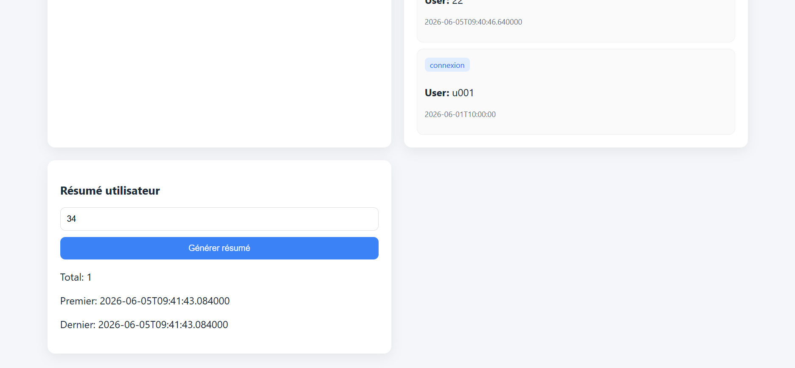

#  Suivi des événements utilisateurs

##  Contexte

Ce projet est une mini application fullstack permettant de gérer et analyser des événements utilisateurs (connexion, transaction, signalement).

Il a été réalisé dans le cadre d’un test technique visant à évaluer :
- la structuration du code
- la qualité de l’architecture
- la clarté de la documentation
- la cohérence des choix techniques

L’objectif est de reproduire une version simplifiée d’un système de tracking d’activité utilisateur sans logique métier complexe.

##  Objectif fonctionnel

L’application permet de :
- créer des événements utilisateurs
- les lister
- obtenir un résumé d’activité par utilisateur

##  Stack technique

### Backend
- FastAPI (Python)
- SQLAlchemy
- PostgreSQL

### Frontend
- React (Vite)
- JavaScript (ES6)

### Infrastructure
- Docker + Docker Compose
- Variables d’environnement (.env)

##  Installation et lancement

###  Mode local

##  Cloner le projet

faites:

git clone https://github.com/franck123-ing-web/suivi-evenements-utilisateurs.git

cd suivi-evenements-utilisateurs

###  Backend

faites: 

cd backend

pip install -r requirements.txt

uvicorn app.main:app --reload

###  Mode Docker

Le projet respecte la contrainte Docker demandée dans le test technique.

## Lancer l’ensemble :

faites:

docker compose up --build

### Frontend

faite les commandes: 

cd frontend

npm install

npm run dev

API disponible :

http://127.0.0.1:8000/docs

##  Aperçu du projet

Quelques captures du fonctionnement de l’application :

###  API FastAPI (Swagger)
L’API est accessible via Swagger UI pour tester les endpoints rapidement

### Création d’un événement 
Interface permettant de créer un événement utilisateur.

### Résumé utilisateur
Statistiques globales d’un utilisateur (nombre d’événements, répartition, dates).

### Structure du projet

suivi-evenements-utilisateurs/

├── backend/
│   ├── app/
│   │   ├── main.py
│   │   ├── database.py
│   │   ├── models.py
│   │   ├── schemas.py
│   │   ├── crud.py
            _init_.py 
│   │   └── routes/
│   │       └── events.py
                _init_.py
│   └── Dockerfile
│
├── frontend/
│   ├── src/
│   │   ├── App.jsx
│   │   ├── main.jsx
            style.css
│   │   ├── components/
│   │   │   ├── EventForm.jsx
│   │   │   ├── EventList.jsx
│   │   │   └── UserSummary.jsx
│   │   └── services/
│   │       └── api.js
│    index.html
│
├── docker-compose.yml
├── .env.example
    .gitignore
    package-lock.json
    package.json
└── README.md

## Fonctionnalités

### API événements

- Création d’un événement utilisateur
- Liste des événements

### Résumé utilisateur

- Nombre total d’événements
- Répartition par type
- Premier événement
- Dernier événement

## Choix techniques

### FastAPI

Choisi pour sa simplicité, sa rapidité et la documentation automatique (Swagger)

### PostgreSQL

Base relationnelle adaptée aux filtres et à la structuration des événements

### SQLAlchemy

Permet une architecture propre et maintenable côté backend

### React

Choisi pour la séparation des composants et la simplicité du rendu UI

#### Limites actuelles

- Pas d’authentification utilisateur
- Pas de pagination avancée
- UI volontairement simple (objectif = fonctionnalité avant design)

### Améliorations possibles

- Authentification JWT
- Pagination et tri avancé
- Dashboard avec visualisation graphique (charts)
- Tests unitaires backend
- Logs et monitoring
- Amélioration UX/UI

### Utilisation de l’IA

L’IA a été utilisée comme assistant de développement pour :

- Structuration initiale du projet
- Debugging
- amélioration de la lisibilité et de l’architecture coté front

### Temps de réalisation

J'ai réalisé ce test dans un temps environ de 2h34 à 3h02 min

##  Difficultés rencontrées et solutions

Au cours du développement plusieurs problèmes techniques ont été rencontrés et résolus :

###  1. Connexion à PostgreSQL
Au démarrage, la configuration de la base de données a généré une erreur de connexion liée à l’URL PostgreSQL et à l’environnement Docker

 Solution :
- correction de la variable `DATABASE_URL`
- ajustement de la configuration SQLAlchemy
- simplification du lancement en mode local

###  2. Erreurs d’import FastAPI / structure backend
Certaines erreurs sont apparues lors du lancement du serveur (imports relatifs et structure des modules)

 Solution :
- réorganisation des imports relatifs
- clarification de la structure `app/`
- séparation propre routes / models / crud

### 3. Erreurs frontend (React + Vite)
Des erreurs de résolution de modules et de rendu initial ont été rencontrées (App.jsx / root element).

 Solution :
- correction du point de montage React (`root`)
- vérification de la structure Vite
- harmonisation des imports

###  5. CORS entre frontend et backend
Les appels API échouaient initialement entre React et FastAPI

 Solution :
- ajout de la configuration CORS dans FastAPI
- autorisation du frontend local

## Conclusion

Projet réalisé par moi Franck joel Nzokou dans le cadre d’un test technique backend

